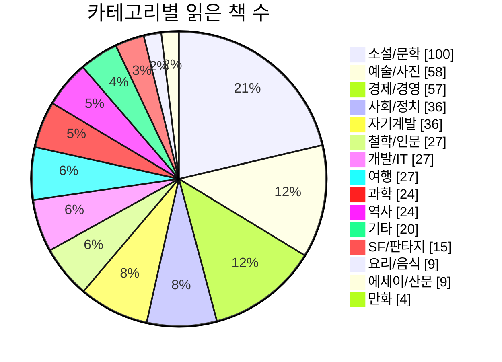
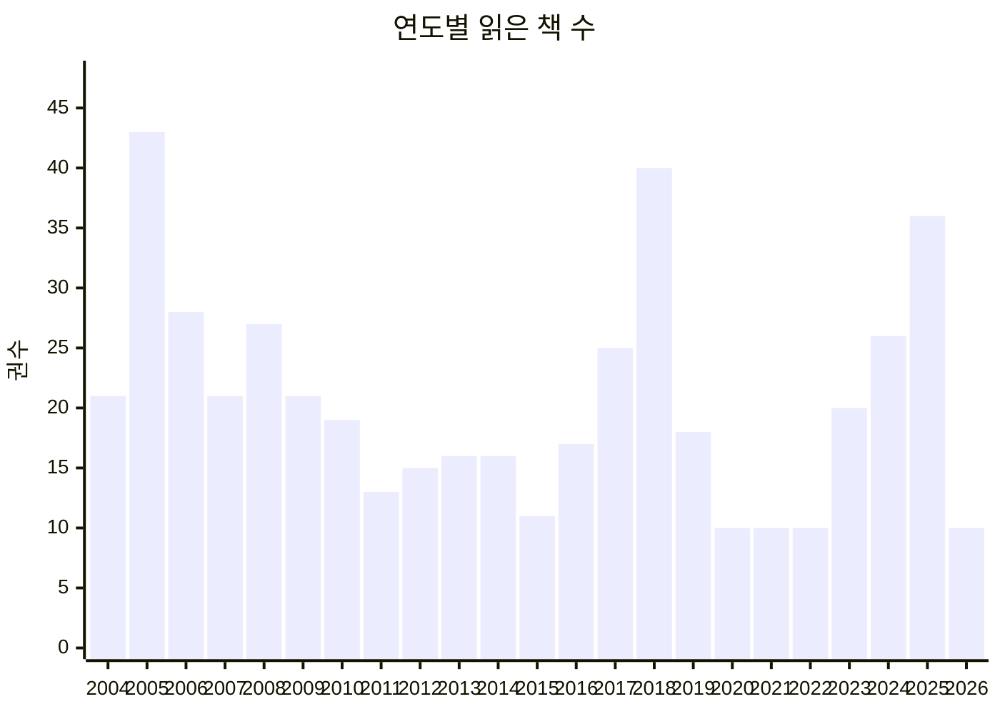

# 📚 읽은 책 통계

> 이 파일은 GitHub Actions에 의해 자동으로 생성됩니다. README.md가 업데이트될 때마다 갱신됩니다.

**총 473권**의 책을 읽었습니다.

## 카테고리별 분포

## 연도별 독서량

## 카테고리별 책 목록

### 소설/문학 (100권)

- (큰글자도서) 달려라,아비 1
- 100인생 그림책
- 69
- 82년생 김지영
- Buzz, the amazing story.
- CmKm
- Fly, Daddy, Fly
- JD 샐린저와 호밀밭의 파수꾼
- Revolution No.3
- The wonderful wizard of OZ
- on the road
- 갈매기의 꿈
- 경양식집에서
- 곰스크로 가는 기차
- 교수대 위의 까치
- 굳빠이, 이상
- 그 골목이 품고 있는 것들
- 그 남자 그 여자
- 그 남자와 그 여자의 사정
- 그 섬에 내가 있었네 -
- 기억 전달자
- 꽃이 보이는 날
- 나무
- 나의 라임오렌지 나무
- 난장이가 쏘아올린 작은공
- 내게 무해한 사람
- 냉정과 열정사이 Blu
- 냉정과 열정사이 Rosso
- 너, 외롭구나 -
- 네가 누구든 얼마나 외롭든
- 다빈치 코드 1,2
- 달과 6펜스
- 당신을 초대합니다
- 당신의 조각들
- 대면 비대면 외면
- 대성당
- 대화
- 데미안
- 동물농장 -
- 레볼루션
- 리틀벳
- 마시멜로 이야기
- 말하는 눈
- 맡겨진 소녀
- 매일을 헤엄치는 법
- 모순
- 묘생만경
- 무라카미 하루키 단편소설선
- 무라카미의 라디오
- 바위를 낚다
- 베로니카 죽기로 결심하다
- 브람스를 좋아하세요...
- 비둘기
- 빨간공책
- 사기
- 사람들 사이로 -
- 살고 싶다는 농담
- 살인자의 기억법
- 세계의 끝 여자친구 -
- 셜록홈즈 : 네 개의 서명
- 셜록홈즈 : 배스커빌 가의 개
- 셜록홈즈 : 주홍색 연구
- 소년이 온다
- 순간을 달리는 할머니 1
- 순간을 달리는 할머니 2
- 숨
- 슬픔이 없는 십오 초
- 신의 망치
- 신화창조의 비밀
- 쓸 만한 인간
- 아몬드
- 알랙산더
- 앨리스 죽이기
- 야옹이와 흰둥이
- 어둠 속의 남자 -
- 여행하는 나무
- 연금술사
- 예감은 틀리지 않는다
- 완두콩
- 우리가 빛의 속도로 갈 수 없다면
- 우연은 비켜 가지 않는다
- 이방인
- 이상한 나라의 앨리스
- 인간실격 -
- 지금 난 여름에 있어
- 채식주의자
- 청춘의 문장들 -
- 청춘표류
- 체의 마지막 일기
- 카프카 - 변신의 고통
- 카프카 단편선(변신, 선고 외...)
- 콘트라베이스
- 크로스 2
- 크리스마스 타일
- 편의점 인간
- 피에로들의 집
- 한 줄도 너무 길다
- 해변의 카프카 1,2
- 호밀밭의 파수꾼 -
- 호텔 선인장

### 예술/사진 (58권)

- Banksy - Wall and Piece
- Banksy Wall and Piece
- Camera People - Photographs by 100 People
- Camera People2 - Photographs by 100 People
- DSLR 활용테크닉
- Gregory Crewdson (사진집)
- H.C.B (브레송)
- Inferno (사진집)
- Magnum
- National Geographic 필드가이드, 여행사진을 잘 찍는 비결
- National Geographic 필드가이드, 인물사진을 잘 찍는 비결
- National Geographic 필드가이드, 풍경사진 잘 만드는 비결
- Photography Book
- The American Wilderness (사진집)
- The Unrooted, 유민의 땅 (사진집)
- 가구의 책
- 가우디, 예언자적인 건축가(?)
- 골목 안 풍경 4
- 구본창 (열화당 사진문고)
- 김영갑 1957~2005 (사진집)
- 김찬용의 아트 내비게이션
- 깜삐돌리오 언덕에 앉아 그림을 그리다 -
- 나는 메트로폴리탄 미술관의 경비원입니다
- 나는 사진이다.
- 나의 첫번째 사진책
- 놀이와 예술 그리고 상상력
- 느낌이 있는 인물사진
- 다른 방식으로 보기
- 디지털 포토그래퍼를 위한 사진관리·보정 가이드
- 디지털 포토그래피 Cool 101
- 디카 마니아, 너만의 작품을 찍어라~!
- 디카족이라면 꼭 읽어야 할 책
- 물오르다 (사진집)
- 미학 오디세이 3 -
- 반 고흐
- 사진 디자인을 위하여
- 사진의 털
- 서양미술사 1 -
- 세계 100대 작품으로 만나는 현대미술강의
- 세상을 바꾼 사진
- 세상을 바라보는 나만의 눈, 다큐멘터리
- 야간사진
- 영화의 탄생
- 유진 스미스 (열화당 사진문고)
- 윤미네 집
- 이상엽의 재미있는 사진책
- 진중권의 서양미술사 고전예술 편
- 진중권의 서양미술사 모더니즘 편
- 진중권의 서양미술사 인상주의 편
- 진중권의 서양미술사 후기 모더니즘과 포스트 모더니즘 편
- 탈춤 매뉴얼
- 포토그래피 필드 가이드 - 디지털 사진
- 포토저널리즘
- 필립 퍼키스의 사진강의 노트
- 하늘에서 본 지구
- 현대 미술은 처음인데요
- 현대 사진을 보는 눈
- 현대예술로서의 사진

### 경제/경영 (57권)

- 21세기 자본
- CEO 안철수, 지금 우리에게 필요한 것은
- IIT 사람들
- LEAD with murex
- NFT 레볼루션
- What's Next 애플&닌텐도
- Why를 소통하는 도구, OKR
- 게임회사 이야기
- 경제 저격수의 고백 -
- 경제, 알아야 바꾼다
- 광고 꿈틀 2
- 구글은 왜 자동차를 만드는가
- 그로스 해킹
- 기본소득이 세상을 바꾼다
- 나쁜 사마리아인들
- 넛지
- 당신은 사업가 입니까
- 당신이 속고 있는 28가지, 재테크의 비밀
- 대체 뭐가 문제야?
- 디멘드
- 딜리버링 해피니스
- 딸기아빠의 펀펀 재테크
- 린 스타트업
- 마케터의 일
- 마케팅 불변의 법칙
- 모든 것의 가격
- 문제는 경제야
- 북유럽 디자인 경영
- 빅피쳐
- 빈곤에 맞서다
- 사업을 한다는 것
- 상식 밖의 경제학
- 서른살부터 시작하는 주식재테크 -
- 순서 파괴 (Working Backwards)
- 슈퍼 괴짜경제학
- 스타트업 바이블
- 스티브잡스
- 실리콘밸리의 팀장들
- 심플을 생각한다
- 아마존, 세상의 모든 것을 팝니다
- 어텐션 팩토리
- 에어비앤비 스토리
- 우리의 월급은 정의로운가
- 유시민의 경제학 카페
- 인스파이어드
- 제로 투 원
- 좋은 기업을 넘어 위대한 기업으로
- 창업국가 -
- 최고의 팀은 무엇이 다른가
- 최진기와 함께 읽는 21세기 자본
- 취향을 설계하는 곳, 츠타야
- 펀드투자가 미래의 부를 결정한다
- 포지셔닝
- 프리라이더
- 하드씽
- 하이 아웃풋 매니지먼트
- 화폐전쟁

### 사회/정치 (36권)

- 1,100만명을 어떻게 죽일까?
- 88만원 세대 -
- 90년생이 온다
- 각자도생 사회
- 국가는 왜 실패하는가
- 남자들은 자꾸 나를 가르치려 든다
- 뉴스의 시대
- 다크패턴의 비밀
- 당신들의 대한민국
- 당신들의 대한민국 2
- 대한민국 원주민 -
- 대한민국 특산품 오!마이뉴스
- 대한민국 표류기 -
- 도시는 무엇으로 사는가
- 말이 칼이 될 때
- 맞아 죽을 각오로 쓴 친일 선언
- 맥도날 그리고 맥도날드화
- 변화하는 세계 질서
- 보이지 않는 중국
- 사회적 자본
- 상식의 배반
- 서울, 젠트리피케이션을 말하다
- 소유의 종말
- 아, 보람 따위 됏으니 야근 수당이나 주세요
- 아이 없는 완전한 삶
- 아프리카에는 아프리카가 없다
- 왜 세계의 절반은 굶주리는가?
- 우리는 모두 페미니스트가 되어야 합니다
- 유시민의 항소이유서
- 이상한 정상가족
- 인간가족
- 일본의 불안을 읽는다 : 일본 트라우마의 비밀을 푸는 사회심리코드
- 지식인의 죄와 벌
- 집단지성이란 무엇인가(We Think)
- 컬처코드 -
- 피로사회

### 자기계발 (36권)

- 100일 글쓰기 곰사람 프로젝트
- 공부중독
- 그들의 생각을 바꾸는 방법
- 끌리고쏠리고들끊다
- 끝도 없는 일 깔끔하게 해치우기
- 내가 알고 있는걸 당신도 알게 된다면
- 내차, 아는 만큼 잘 나간다
- 뉴욕타임즈 편집장의 글을 잘 쓰는 법
- 다윗과 골리앗
- 달리기를 말할 때, 내가 하고 싶은 이야기
- 달리기의 모든 것
- 당신의 주말은 몇개 입니까?
- 데일 카네기 인간관계론
- 말 잘하는 비결
- 면접의 달인 바이블 편
- 몰입
- 부의 추월차선
- 분노하라
- 설득의 심리학
- 스누피의 글쓰기 완전정복
- 스토리텔링 7단계
- 스티브 잡스의 프레젠테이션
- 스프린트
- 시골의사 박경철의 자기혁명
- 심플하게 산다
- 아무튼, 달리기
- 아무튼, 요가
- 원씽
- 유혹하는 글쓰기
- 일을 버려라
- 커리어 그리고 가정
- 콰이어트
- 쿨하게 사과하라
- 티핑포인트
- 파워풀
- 행복보고서, 유한 캠벌리

### 철학/인문 (27권)

- 개인주의자 선언
- 게으름에 대한 찬양
- 교양 - 사람이 알아야 할 모든 것 -
- 군주론
- 그림으로 이해하는 정치사상
- 나는 왜 기독교인이 아닌가
- 나의 사주명리
- 내가 옳고, 네가 틀려!
- 더 나은 논쟁을 할 권리
- 미학 오디세이 1
- 미학 오디세이 2
- 민족이란 무엇인가 - 에르네스트 르낭 -
- 백치를 철학자로 만드는 Royal-Raod
- 쇼펜하우스 수상록
- 슬픔을 공부하는 슬픔
- 승려와 수수께끼
- 어떻게 살 것인가
- 요가의 언어
- 우리가 사랑해야 하는 것들에 대하여
- 자유로부터의 도피
- 정의란 무엇인가
- 죽음의 수용소에서
- 지식인의 책무 -
- 질문하는 세계
- 탈무드
- 현대 한국 지성의 모험
- 혼자 시작하는 사주명리 공부

### 개발/IT (27권)

- AI 엔지니어링
- Inside PC
- 가상 면접 사례로 배우는 대규모 시스템 설계 기초
- 가상 면접 사례로 배우는 머신러닝 시스템 설계 기초
- 개발 7년차, 매니저 1일차
- 거의 모든 IT의 역사
- 구글드
- 그로쓰 해킹
- 누가 소프트웨어의 심장을 만들었을까?
- 맨먼스 미신
- 머신러닝 시스템 설계
- 모바일 이노베이션
- 비즈니스 에버노트
- 사용자 스토리 맵 만들기
- 사회 네트워크 분석
- 시각 장애인의 코딩 학습 기록
- 시맨틱 웹 - 웹 2.0시대의 기회 -
- 요즘 AI 에이전트 개발
- 조엘 온 소프트웨어 -
- 칸반과 스크럼
- 코딩을 지탱하는 기술
- 테크니컬 리더
- 프로그래밍 면접 이렇게 준비한다
- 피닉스 프로젝트
- 피플웨어
- 함께 자라기 (애자일로 가는 길)
- 해커와 화가

### 여행 (27권)

- 굴러라 유럽! - 두근두근 자동차여행 가이드북 -
- 굿바이, 서촌
- 나의 문화유산답사기 10 서울편 2
- 나의 문화유산답사기 9 서울편 1
- 낡은 카메라를 들고 떠나다
- 낡은 카메라를 들고 떠나다 2
- 단양 그리고 영월 (아는 여행 01)
- 동유럽 문화도시 기행
- 두나's 도쿄놀이
- 두나's 런던놀이
- 디지털 노마드
- 라오스에 대체 뭐가 있는데요?
- 먼나라 이웃나라 미국편 1
- 미애와 루이가족, 45일간의 아프리카 여행
- 방랑
- 삿포로 갔다가 오타루 살았죠
- 서른 살에 스페인
- 서촌방향
- 스페인을 여행하는 세가지 방법
- 시베리아 횡단철도 - 잊혀진 대륙의 길을 찾아서
- 여행의 이유
- 오래된 서울
- 우리 도시 예찬 -
- 지도로 보아야 보인다
- 파리스케치
- 한번쯤 포르투갈
- 행복이 번지는 곳, 크로아티아

### 과학 (24권)

- 과학으로 파헤친 세기의 거짓말
- 관찰의 힘
- 누워서 과학 먹기
- 더 브레인
- 도파민네이션
- 두 문화
- 랩걸
- 러셀이 들려주는 패러독스 이야기 -
- 링크
- 마스터 알고리즘
- 물고기는 존재하지 않는다
- 사피엔스
- 상상력의 천국, MIT 미디어랩
- 생각에 관한 생각 -
- 생각의 지도 -
- 소셜 비헤이비어
- 스키너의 심리학 상자
- 습지생태보고서
- 우울할 땐 뇌 과학
- 이것이 새입니까?
- 이공계로 날고 싶어요
- 이기적 유전자
- 지식의 미래
- 팩트풀니스

### 역사 (24권)

- 40가지 테마로 읽는 도시 세계사
- 거꾸로 읽는 세계사
- 나의 한국현대사
- 난징의 강간
- 대한민국사 1권
- 대한민국사 2권
- 대한민국사 3권
- 대한민국사 4권
- 디알북, 대한민국 사실은.....
- 러시아 혁명
- 분단의 향기
- 성곽을 거닐며 역사를 읽다
- 역사 e
- 역사의 역사
- 우리가 아는 미국은 없다
- 이슬람의 눈으로 본 세계사
- 자본주의 역사 바로 알기 -
- 전태일 평전
- 정조의 비밀일기
- 책의 역사
- 처음 읽는 아프리카의 역사
- 체게바라 평전
- 한국, 한국인
- 현장에서 만난 20th C

### 기타 (20권)

- Grouped
- Smile Again!
- 광고천재 이제석 - 세계를 놀래킨 간판쟁이의 필살 아이디어
- 꼬끼리는 생각하지마
- 라프코스터의 재미이론
- 베르나르 베르베르의 상상력 사전
- 시대예보: 경량문명의 탄생
- 아무튼, 식물
- 월스트리트 저널 인포그래픽 가이드
- 위트상식사전
- 임신테스트기
- 지식 e 1권
- 지식 e 2권
- 지식 e 4권
- 지식 e 8
- 지식인의 서재
- 차덕후, 처음 집을 짓다
- 태양아래 모든 것이 특허 대상이다
- 한권 (책 이름이 기억 안나서 찾는 중)
- 한장의 절대 지식

### SF/판타지 (15권)

- 1984
- 21세기 오디세이
- SFnal 2021 Vol.1
- 낙원의 샘
- 높은 성의 사내
- 마니아를 위한 세계 SF 걸작선 -
- 멋진 신세계
- 별의 계승자
- 삼체 : 1부
- 설국열차
- 성리학 펑크 2077
- 아무튼, SF 게임
- 안드로이드는 전기양의 꿈을 꾸는가?
- 크로스 -
- 현실 온라인 게임

### 요리/음식 (9권)

- 고기로 태어나서
- 돈까스를 쫓는 모험
- 라면은 멋있다
- 레시피보다 중요한 100가지 요리 비결
- 바리스타를 위한 커피머신 첫걸음
- 식객 1~3권
- 신의 칵테일 300
- 최강록의 요리 노트
- 파스타 마스터 클래스

### 에세이/산문 (9권)

- 30년 만의 휴식
- 남자의 물건
- 모든 요일의 기록
- 모리와 함께한 일요일
- 보통의 존재
- 숨결이 바람이 될 때
- 시골의사의 아름다운 동행 1
- 시절일기
- 쓰기의 말들

### 만화 (4권)

- 만화로 보는 소피의 세계 1
- 만화로 보는 소피의 세계 2
- 미생
- 비즈니스 모델 1권 (만화)

## 연도별 통계

| 연도 | 권수 | 그래프 |
|------|------|--------|
| 2026 | 10 | ████ |
| 2025 | 36 | ████████████████ |
| 2024 | 26 | ████████████ |
| 2023 | 20 | █████████ |
| 2022 | 10 | ████ |
| 2021 | 10 | ████ |
| 2020 | 10 | ████ |
| 2019 | 18 | ████████ |
| 2018 | 40 | ██████████████████ |
| 2017 | 25 | ███████████ |
| 2016 | 17 | ███████ |
| 2015 | 11 | █████ |
| 2014 | 16 | ███████ |
| 2013 | 16 | ███████ |
| 2012 | 15 | ██████ |
| 2011 | 13 | ██████ |
| 2010 | 19 | ████████ |
| 2009 | 21 | █████████ |
| 2008 | 27 | ████████████ |
| 2007 | 21 | █████████ |
| 2006 | 28 | █████████████ |
| 2005 | 43 | ████████████████████ |
| 2004 | 21 | █████████ |
